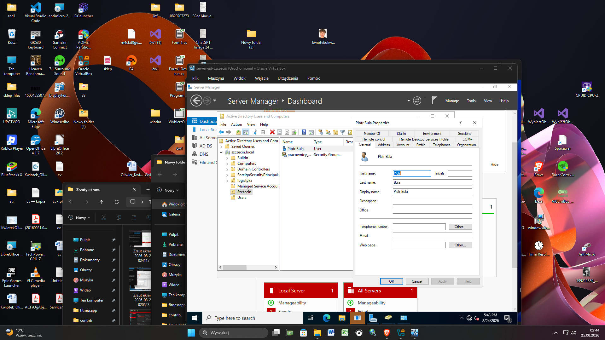
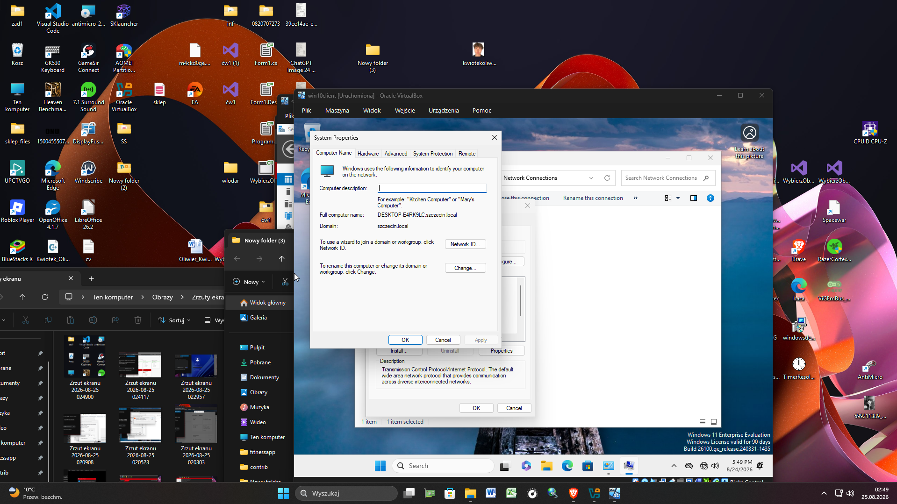

Kwiotek Oliwier -  Windows Server & Active Directory Lab: Konfiguracja Środowiska Domenowego

📌 Cel Projektu
Projekt przedstawia kompleksową konfigurację środowiska wirtualnego, obejmującą wdrożenie serwera z rolą kontrolera domeny (Active Directory) oraz bezpieczne podłączenie do niej stacji roboczej. Projekt symuluje wdrożenie infrastruktury IT dla regionalnego biura lub centrum logistycznego, demonstrując umiejętność zarządzania dostępem i centralizacji poświadczeń pracowników.

## 🛠️ Wykorzystane Technologie
  * **Wirtualizacja:** Oracle VM VirtualBox
* **System Serwerowy:** Windows Server
* **System Kliencki:** Windows 11
* **Usługi Sieciowe:** Active Directory Domain Services (AD DS), DNS, IPv4 (Statyczna adresacja)

---

## 🚀 Etapy Realizacji i Dokumentacja

### Etap 1: Izolacja Środowiska Sieciowego
Utworzenie bezpiecznej sieci wewnętrznej (Internal Network) w środowisku wirtualnym, aby odizolować ruch laboratoryjny od sieci domowej.

### Etap 2: Wdrożenie Serwera i Active Directory
Konfiguracja statycznego adresu IP na serwerze, instalacja kluczowych ról systemowych (AD DS, DNS) oraz utworzenie struktury organizacyjnej wraz z testowym kontem pracownika.

**Konfiguracja adresacji IPv4 (Serwer):**

**Aktywne role na serwerze (Server Manager):**

**Struktura Active Directory (Konto użytkownika):**

### Etap 3: Podłączanie Stacji Roboczej
Skonfigurowanie ustawień sieciowych na komputerze z systemem Windows 11 tak, aby rozwiązywanie nazw (DNS) kierowało na serwer kontrolera domeny, a następnie wpięcie systemu do domeny `szczecin.local`.

**Konfiguracja adresacji IPv4 i DNS (Klient):**

**Potwierdzenie członkostwa stacji roboczej w domenie:**

### Etap 4: Weryfikacja Logowania i Dostęp
Autoryzacja użytkownika domenowego na klienckiej stacji roboczej w celu potwierdzenia poprawnego działania usług katalogowych.

**Ekran logowania do domeny:**

**Załadowany profil użytkownika domenowego:**

---

💡 Nabyte Umiejętności
Realizacja tego środowiska pozwoliła mi w praktyce przetestować:
* Zarządzanie tożsamością i dostępem (IAM) przy pomocy Active Directory.
* Konfigurację protokołów sieciowych (statyczne IP, DNS) w zamkniętym środowisku.
* Obsługę systemów z rodziny Windows Server oraz rozwiązywanie problemów z komunikacją w sieci LAN.
* Konfigurację maszyn wirtualnych i zarządzanie zasobami (VirtualBox).
